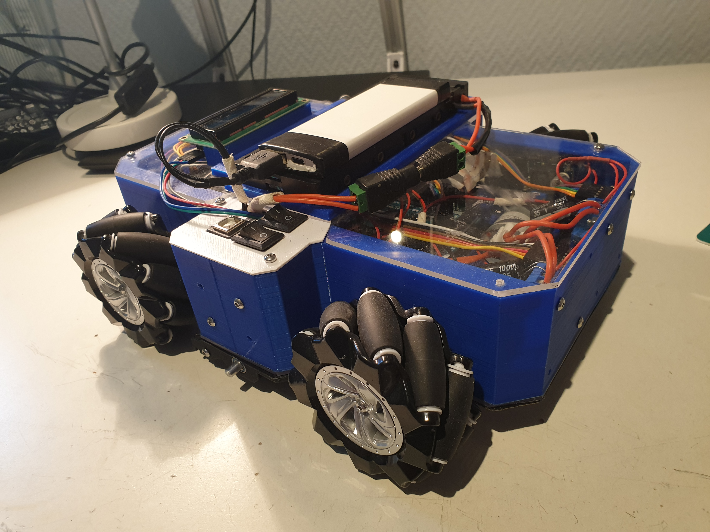
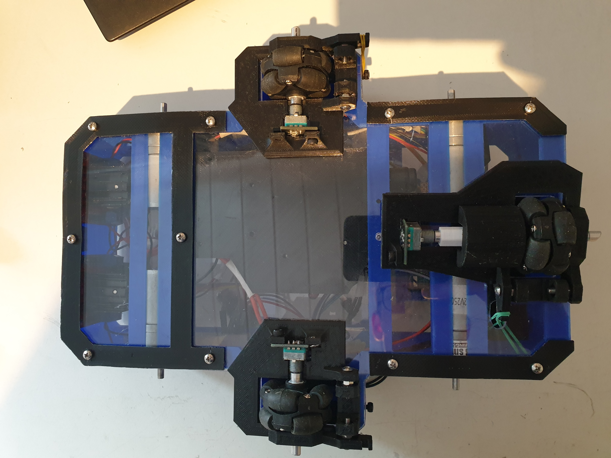
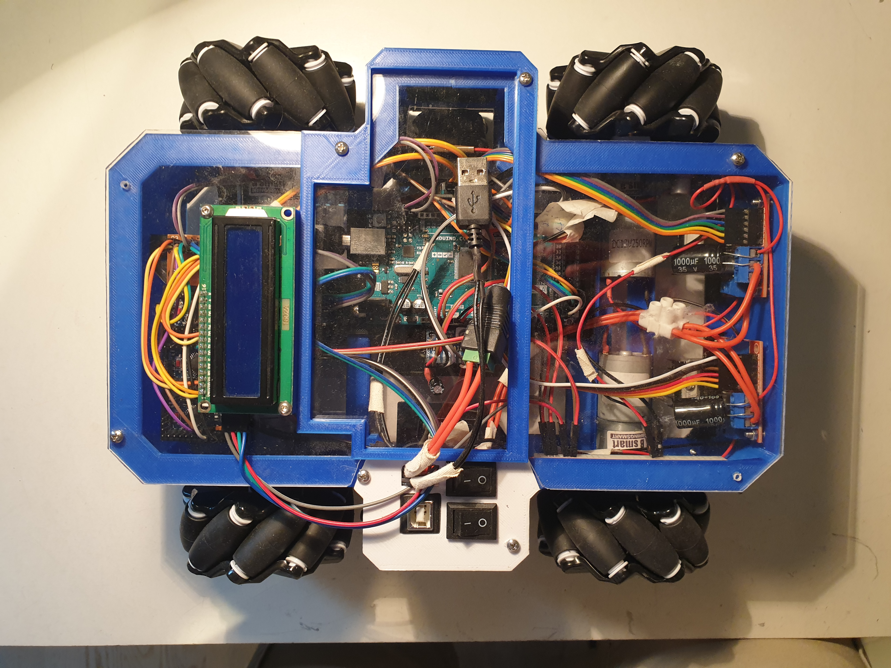

# robotCar - Still in progress
A remote controlled robot car with a meccanum drivetrain.
The inspiration for this project was taken from the many First Tech Challenge (FTC) robots that use a meccanum wheel drivetrain with position tracking. The components used in FTC robots are quite expensive, and I wanted to design a low-cost version of these robots,

## Objectives
- [x] Meccanum drivetrain that enables the car to drive in all directions.
- [x] Remote control for the car.
- [x] Position tracking system consisting of 3 small omni wheels with encoders.
- [ ] PID-control for each axis of movement (x, y and rotation).
- [ ] Follow a path (predetermined in the program using some sort of a grid), using three omniwheels tracking the movement of the car.

## Design
### Meccanum drivetrain
A meccanum wheel consists of two disks with smaller wheels (rollers) attached in between them. The axis of the rollers are at 45° to the wheel plane and 45° to the axis perpendicular to the disks. A meccanum drivetraing consits of four meccanum wheels, each with it's own DC-motor. By adjusting the speed of each wheel, one can make the drivetrain move in any direction.
### Position tracking (used for odometry)
Tracking the car's position is not easily achieveable as the the meccanum wheels used for the drivetrain slips a lot, which removes the possibilty of using encoders on the drivetrain motors to track the position. Instead, three omni wheels (almost like meccanum wheels, but the axis of the rollers are parallel to the wheel plane), each with it's own rotary encoder is used. To ensure contact with the ground and avoid slipping, the omni wheels were mounted on a small platform with a rubber band forcing them into the ground. By constantly checking the change of the three encoders, the change in the robot's position can be found. 

Demo of the position tracking algorithm. Some error is present, as expected, but it is usable. The error is mainly caused by missed encoder-steps and the encoders low resolution (only 40 steps per revolution), causing accumulative error in the position caclulations.

### Electronics
- Gyro (mpu6050). Experimented with using motion data from the sensor to caculate changes in the position, but the data had to much jitter. Did work to keep track of orientation.
- Arduino Mega (main brain of car).
- Three Arduino Pro Minis (in an effort to detect all steps from the rotary encoder, each encoder was connected to it's own designated Arduino responsible for counting the steps of the encoder).
- Four DC-motors
- Two L298N Motor Drivers
- Battery pack (used by motors)
- Power bank (used by the other electronics to avoid voltage spikes caused by motors)
- Buck converter (transform voltage from power bank)
- LCD (display the position of the robot)
- Four KY-040 Rotary Encoders
- nrf24l01 (radio module)
- A miscellaneous collection of common components (wires, capacitors, switches)

## Remote control
Demo of the car being controlled by a remote control. It is using the position tracking combined with a PID-controller to keep the same orientation.

## Path following
The interesting aspect of this project was to make it follow a path (a simple path: drive straight to the left for 10cm, 10cm forward, 10cm diagonally, or a more complex one: a circle, any mathematical curve). By interpolating through the path, using feedback from the position tracking to make sure the car drives to each sub-point on the path, one can ultimately follow any path. 

